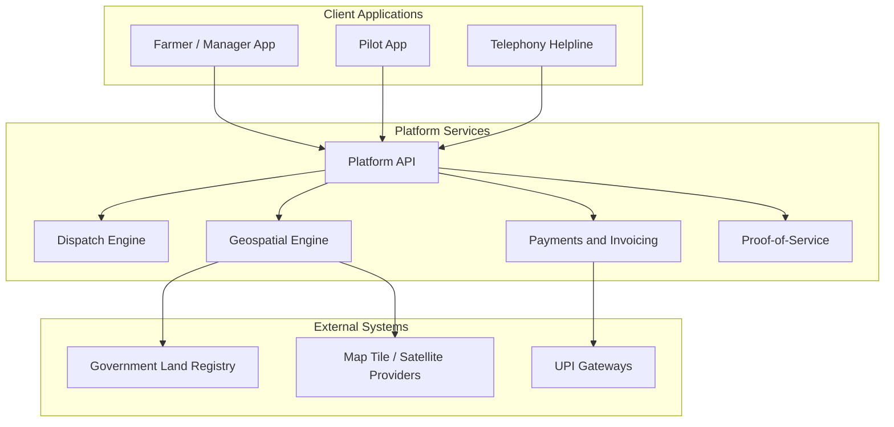

# Skynet Drone Services — Target Architecture

**Date:** 2026-05-26  
**Status:** Conceptual (from PRD; implementation not started)  
**Source:** `output/planning-artifacts/prd/skynet-drone-services/prd.md`

## Executive Summary

Skynet is a **B2B2C drone-as-a-service marketplace** for Tamil Nadu agriculture. The platform connects land owners and farm managers with DGCA-certified pilots for precision spraying, mapping, and related services. Architecture centers on a **tenant hierarchy**, **map-first mobile UX**, and **offline-first** operation for rural connectivity.

## System Context

## Planned System Parts

| Part | Type | Purpose |
|------|------|---------|
| Farmer / Manager App | Mobile | Map-first booking, plot management, dashboards |
| Pilot App | Mobile | Job execution, GPS telemetry, geo-tagged evidence |
| Platform API | Backend | Tenancy, booking, dispatch, payments, geospatial processing |

## Technology Stack (Target — TBD)

Implementation choices are not yet committed. PRD implies mobile (offline-first, maps), backend API, PostgreSQL-class geospatial store, and UPI payments.

## Tenant Hierarchy

- **Parent tenant (estate):** View-only aggregate dashboards; cannot book (avoids accidental bulk bookings).
- **Child tenant (plot/manager):** Operational booking, KMZ boundaries, offline map cache.

## NIDHI-PRAYAS Physical Prototype (Grant Track)

For **NIDHI-PRAYAS** eligibility (physical prototype), the lead hardware artifact is the **Proof-of-Coverage Verification Module (PCVM)** — see [NIDHI-PRAYAS pitch deck](../output/planning-artifacts/grants/nidhi-prayas/skynet-nidhi-prayas-pitch-deck.md).

---

_Conceptual architecture from PRD. Update when `bmad-create-architecture` output is available._
