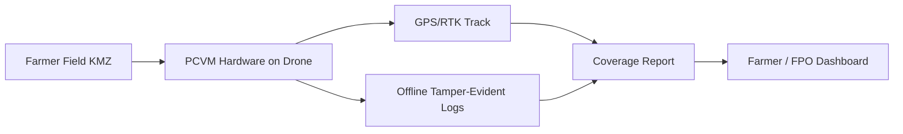
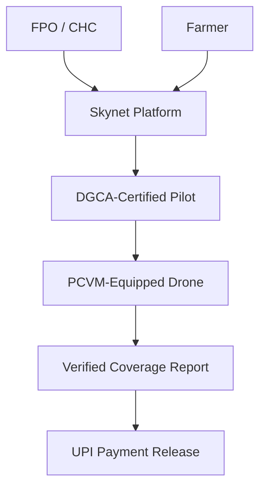

# Skynet — NIDHI-PRAYAS Grant Pitch Deck

**Applicant project:** Skynet Agricultural Drone Proof-of-Coverage System  
**Program:** NIDHI-PRAYAS (DST, Govt. of India) · Grant up to **₹10,00,000** · Duration **up to 18 months (Skynet plan: 6-8 months)**  
**Sector:** Agriculture · IoT · Precision Farming  
**Date:** May 2026  
**Status:** Draft for PRAYAS Centre submission  

> **How to use:** Each `## Slide N` section = one presentation slide. Export to PowerPoint/Google Slides or use Marp/Reveal.js. Replace `[PLACEHOLDER]` fields before submission.

---

## Slide 1 — Title

# Skynet
### Verifiable Drone Spray Coverage for Tamil Nadu Farmers

**NIDHI-PRAYAS Prototype Grant Application**

- **Innovator / Startup:** Skynet  
- **Location:** Coimbatore, Tamil Nadu  
- **Grant sought:** ₹ 10,00,000   
- **Duration:**  6 months  

*Making every acre of drone spray accountable — hardware-verified, farmer-trusted.*

---

## Slide 2 — The Problem

### Farmers pay for drone spraying — but cannot verify it happened

| Pain Point | Impact |
|------------|--------|
| **No proof of coverage** | Disputes over whether full field was sprayed; trust barrier to adoption |
| **Manual labour shortage** | Tamil Nadu faces acute farm labour gaps; drones are essential, not optional |
| **Chemical waste & cost** | Without precision verification, over/under-spray wastes ₹ and damages crops |
| **Smallholder exclusion** | 74% of TN farmers hold < 1 ha; need affordable DaaS, not ₹3–15L drone ownership |

**Farmer question today:** *"Did the pilot actually cover my entire field?"*  
**There is no affordable, field-deployable answer.**

_Sources: Skynet market research (2026); TNAU landholding data; ResearchGate TN drone adoption studies_

---

## Slide 3 — Our Solution

### Skynet Proof-of-Coverage Verification Module (PCVM)

A **physical IoT prototype** that mounts on agricultural spray drones to:

1. **Record centimetre-accurate GPS flight tracks** during spray operations  
2. **Create tamper-evident, offline flight logs** for low-connectivity rural operations  
3. **Generate geo-verified coverage maps** overlaid on field KMZ boundaries  
4. **Sync proof reports** to farmer and FPO workflows (post-prototype phase)

**This grant funds the physical prototype — not a software-only platform.**

---

## Slide 4 — Innovation & Technical Differentiation

### Why this is science & technology innovation, not just an app

| Component | Innovation |
|-----------|------------|
| **Low-cost hardware + software proof** | GPS track + boundary analytics provides verifiable, repeatable proof-of-coverage |
| **Field boundary alignment** | Auto-overlay of flight path on KML/KMZ plot boundary with gap detection |
| **Rural-edge design** | Offline data logging; sync when connectivity returns |
| **DGCA-compatible** | Hazard pin export to pilot flight controller (future integration) |
| **Trust layer for DaaS** | Enables per-acre accountability at the ₹350–450 "magic price point" |

**Existing competitors** (SkyX, Aerotics, Skylar — Coimbatore region) offer spraying services but **lack standardized, software-backed service**.

---

## Slide 5 — Physical Prototype (NIDHI-PRAYAS Focus)

### What we will build in 6-8 months (prototype-focused)

**Primary deliverable:** **PCVM Gen-1 (Minimal Hardware + Proof Report)** — a field-ready hardware logger + a software-generated proof packet, validated in Coimbatore district.

| Sub-system | Physical components (capped scope) |
|------------|---------------------|
| **Positioning** | Multi-GNSS module (GPS + GLONASS) flight-track logger (RTK optional only for demo plots) |
| **Edge compute + storage** | Microcontroller + non-volatile storage for offline, tamper-evident logging |
| **Enclosure + mounting** | Rugged enclosure + universal mounting bracket for common ag-spray drone frames |
| **Power** | Safe regulated power tap from drone battery (or independent pack) |
| **Output** | Exportable **Proof-of-Coverage Packet**: GPX/GeoJSON track + coverage % vs KMZ boundary + gap highlights |

**Deliberately out-of-scope for Gen-1 (stretch goals):** inline flow sensing and automated chemical proof (we keep Gen-1 feasible and prototype-complete).

**PRAYAS Shala use:** enclosure iterations, mounting jig fabrication, basic PCB/perfboard builds, field hardening.

**TRL progression:** Idea (TRL 2) → Lab prototype (TRL 4) → Field-validated prototype (TRL 6)

---

## Slide 6 — Market Opportunity

### Tamil Nadu agricultural drone services — large and growing

| Metric | Data |
|--------|------|
| **Target geography** | Coimbatore entry → Western TN → Delta paddy belt |
| **Farmer segments** | Marginal (74%), Small (14%), FPOs/cooperatives |
| **DaaS pricing band** | ₹300–700/acre (market established) |
| **Adoption driver** | 30–40% pesticide reduction vs manual; 5–10 min/acre spray time |
| **Government tailwinds** | SMAM subsidies, NaMo Drone Didi, CHC infrastructure |

**Serviceable entry market (Year 1 post-prototype):**  
500 farmers × 4 sprays/season × ₹400/acre = **₹8,00,000 GMV** (single pilot cluster)

**Scale path:** FPO contracts (500–5,000 acres) → ₹2L–25L/season per FPO

---

## Slide 7 — Business Model

### B2B2C marketplace — proof-of-service as the trust moat

| Revenue stream | Description |
|----------------|-------------|
| **Per-acre service fee** | ₹400–600/acre (spray + verified report) |
| **FPO/estate contracts** | Seasonal bulk pricing ₹300–400/acre |
| **PCVM licensing** | Hardware module rental/sale to pilot partners (post-commercialization) |
| **Data services** | NDVI/monitoring upsell (Phase 2) |

**NIDHI-PRAYAS phase:** Prototype validation only — revenue begins after 6-8 month field proof.

---

## Slide 8 — Competitive Landscape

| Player | Strength | Gap Skynet fills |
|--------|----------|------------------|
| Regional drone operators (SkyX, Aerotics, Skylar) | Local presence, spraying capacity | No standardized proof-of-coverage |
| Agrochemical companies | Distribution, farmer trust | Not service operators |
| Generic drone manufacturers | Hardware | No TN-specific DaaS + verification stack |
| Software-only agtech apps | Booking UX | No physical spray verification; rural offline gaps |

**Skynet moat:** Hardware-verified proof + Tamil Nadu-first GTM via FPOs/CHCs + telephony helpline for non-digital farmers.

---

## Slide 9 — 6-8 Month Prototype Roadmap

| Phase | Months | Milestones | Deliverable |
|-------|--------|------------|-------------|
| **1. Design & procurement** | 1 | Requirements freeze; BOM lock; procurement kickoff | Design docs, BOM v1 |
| **2. Lab build** | 2–3 | PCB/perfboard bring-up; GNSS reliability and offline logging validation | PCVM lab prototype |
| **3. Drone integration** | 4–5 | Mount on 10L spray drone; bench + tethered tests | Integrated prototype |
| **4. Field trials** | 6–7 | 3 crop types, ≥10 fields, Coimbatore; iterate enclosure | Field-validated PCVM |
| **5. Final package** | 8 | Coverage algorithm v1; commercialization plan; DST reporting | Final prototype + report |

**Success criteria:** ≥95% boundary coverage detection accuracy on demo plots; reliable offline log integrity; 20+ farmer/pilot feedback sessions.

---

## Slide 10 — Grant Utilization (₹10,00,000 Budget)

| Head | Amount (₹) | % | Details |
|------|-----------|---|---------|
| **Sensors & electronics** | 2,50,000 | 25% | GNSS module, MCU, storage, PCB/perfboard, connectors |
| **Drone integration & mechanical** | 1,80,000 | 18% | Mounts, enclosures, 3D print, fastener kits, test drone access |
| **Field testing & logistics** | 1,50,000 | 15% | Plot access, crop trials, travel, farmer engagement |
| **Fab lab / prototyping** | 1,20,000 | 12% | PRAYAS Shala equipment time, PCB fab, tooling |
| **Software (logging firmware only)** | 80,000 | 8% | Embedded firmware for PCVM — not a software grant |
| **Certification & safety** | 70,000 | 7% | DGCA consultation, electrical safety checks |
| **Contingency** | 1,50,000 | 15% | Sensor failure, iteration cycles |

**Total:** ₹10,00,000  

*Note: NIDHI-PRAYAS funds cannot be used for innovator salary. All costs align with DST permitted heads.*

---

## Slide 11 — Team

| Role | Name | Background |
|------|------|------------|
| **Lead Innovator** | [Name] | [Degree / experience — e.g., agri-tech, embedded systems] |
| **Hardware / IoT** | [Name] | [Sensor integration, PCB design] |
| **Agriculture domain** | [Name / Advisor] | [TNAU / KVK / FPO linkage] |
| **Drone operations** | [Name / Advisor] | [DGCA Remote Pilot License #] |
| **Business / GTM** | [Name] | [FPO partnerships, Tamil Nadu market] |

**Institutional support:** [Incubator / TBI / University — if any]  
**NOC status:** [From employer/university — if applicable]

---

## Slide 12 — Traction & Validation (Pre-Grant)

| Evidence | Status |
|----------|--------|
| Market research completed | ✅ Tamil Nadu drone services report (May 2026) |
| Product requirements documented | ✅ Skynet PRD with personas, journeys, FRs |
| Farmer pain points validated | ✅ Research: proof/trust, price sensitivity, DaaS preference |
| Technical architecture drafted | ✅ Target platform documented |
| Prototype built | ❌ **This is what NIDHI-PRAYAS funds** |
| FPO / pilot LOIs | ⬜ [Add letters of intent if available] |
| Bootstrapped investment | ⬜ [Amount, if any — strengthens application] |

**Planned validation during grant:** 10 field trials with Coimbatore FPO; pilot partner MOU.

---

## Slide 13 — IP, Compliance & Eligibility

| Item | Plan |
|------|------|
| **IP ownership** | All IP generated vests with [Startup Name / Innovator] per NIDHI-PRAYAS terms |
| **Prior funding** | No prior government grant for this prototype |
| **Incorporation** | [Status — startup ≤7 years, ≤₹25L turnover, 51% Indian equity if applicable] |
| **Citizenship** | Indian citizen — Aadhaar/passport on file |
| **Incubation commitment** | Will pre-incubate/incubate at selected PRAYAS Centre for full prototype cycle (6-8 months planned; extendable per PC norms) |
| **DGCA** | Prototype tests with licensed RPAS operators; no autonomous flight beyond approved scope |

---

## Slide 14 — Commercialization Roadmap (Post-Prototype)

| Timeline | Milestone |
|----------|-----------|
| **Month 9–12** | PCVM Gen-1 pilot batch (20–30 units); 3 pilot partners in Coimbatore |
| **Month 12–18** | Skynet booking platform beta; telephony helpline for smallholders |
| **Month 18–24** | FPO contracts in 3 districts; early unit economics validation |
| **Year 3+** | Expand to delta paddy belt; NDVI monitoring upsell; PCVM licensing nationally |

**Startup creation:** Register [Startup Name] upon prototype validation; seek seed round aligned with ₹8L+ Year-1 GMV target.

---

## Slide 15 — The Ask

# We request ₹ [X] lakhs under NIDHI-PRAYAS

### To build and field-validate the Skynet Proof-of-Coverage Verification Module

**Why now:**
- Tamil Nadu is a top-5 state for ag-drone adoption  
- Agriculture is a **priority sector** under NIDHI-PRAYAS  
- Farmers need **trust infrastructure** before DaaS scales to marginal holders  

**What you get:**
- A field-tested physical prototype (TRL 6)  
- Clear commercialization path via FPO-led DaaS  
- IP retained in India; aligned with Atmanirbhar agri-tech goals  

**PRAYAS Centre requested:** [Name of centre — e.g., TIDES IIT Roorkee / local TN centre]

---

### Contact

**[Lead Innovator Name]**  
📧 [email] · 📱 [phone]  
🌐 [website — if any]  
📍 Coimbatore, Tamil Nadu  

---

## Appendix A — Alignment with NIDHI-PRAYAS Criteria

| Criterion | Skynet alignment |
|-----------|------------------|
| Physical product prototype | ✅ PCVM hardware on spray drone |
| S&T innovation | ✅ Sensor fusion + geo-verified coverage |
| Priority sector: Agriculture | ✅ Core use case |
| Priority sector: IoT | ✅ Edge IoT module with field sensors |
| PoC stage (not past prototype) | ✅ Pre-implementation |
| 18-month max duration | ✅ 6-8 month plan is within limit |
| Clear commercialization path | ✅ DaaS + PCVM licensing |
| Bootstrapped / co-investment | ⬜ Add if applicable |
| Women / young innovator preference | ⬜ Highlight if applicable |

---

## Appendix B — Supporting Documents Checklist

Submit alongside this deck per PRAYAS Centre call:

- [ ] Duly filled NIDHI-PRAYAS application form  
- [ ] Formal business plan (expand from this deck)  
- [ ] This business presentation / investment proposal  
- [ ] Proof of Indian citizenship (Aadhaar / passport / voter ID)  
- [ ] Passport-size photograph  
- [ ] NOC from parent institution/employer (if applicable)  
- [ ] SC/ST certificate (if applicable)  
- [ ] Detailed budget spreadsheet (export from Slide 10)  

**Apply via:** [https://nidhi-prayas.org/prayascenters.html](https://nidhi-prayas.org/prayascenters.html) — select a PRAYAS Centre and watch for their call for applications.

---

_Drafted by Paige (Skynet Technical Writer) · Sources: Skynet PRD, market research, NIDHI-PRAYAS program guidelines (DST). Replace all `[PLACEHOLDER]` fields before submission._
